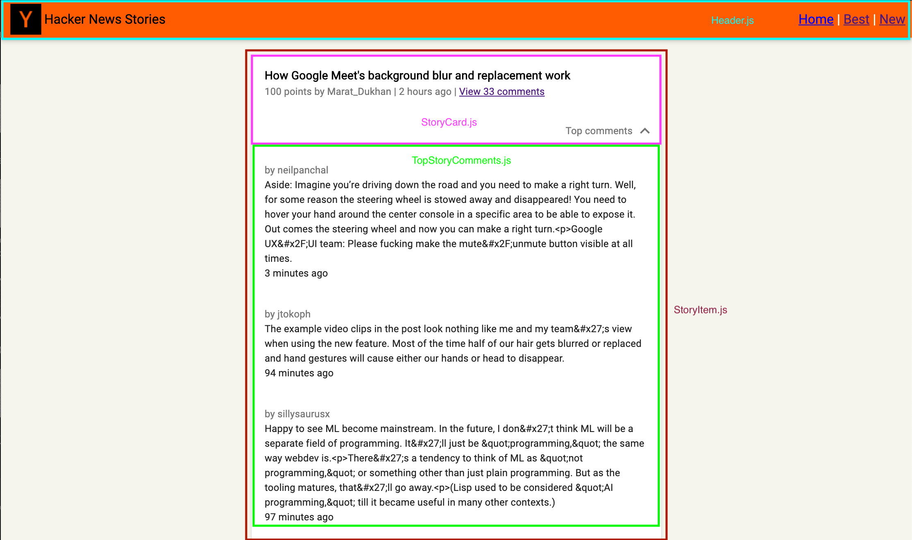
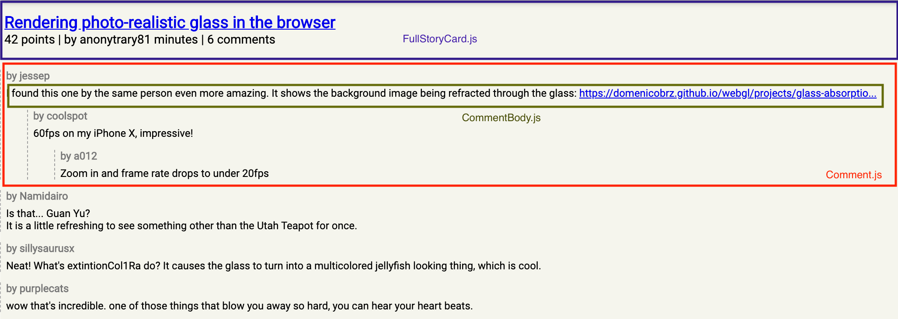

# Hacker News Feed
This project is an alternative UI for the currently existing [Hacker News Feed](https://news.ycombinator.com/news). 
The data used for this project is retrieved using the [Firebase](https://www.npmjs.com/package/firebase) npm package. 

## Set Up Instructions and Commands
In your terminal, navigate to the hackernews-ui directory, and from the root folder run:

- `$ npm install` to install all dependencies

- `$ npm start` to start up the app in the development mode.\
Open [http://localhost:4000](http://localhost:4000) to view it in the browser.\
The page should reload if you were to make edits, and show you errors in the console if there are any.

### Additional Commands
- `$ npm test` to launch the test runner in the interactive watch mode.

- `$ npm run build` to build the app for production to the `build` folder.\
It correctly bundles React in production mode and optimizes the build for the best performance.

## Technologies Used
For this UI project, [Create React App](https://github.com/facebook/create-react-app) was used to get started on development right away. I additionally used [Material-UI](https://material-ui.com/) 
for some components because of additional functionality their components offer.
[React Router](https://reactrouter.com/) was also used to make this application more functional in regard to being a single page app. And lastly, [Firebase](https://www.npmjs.com/package/firebase) was used to fetch Hacker News data. 

## UI Component Design
The images below highlight some of the more important components involved in this UI project. 
My hope is that the images will provide some context and guidance as you look through the code. The first image shows the main design for the
main landing page with hacker news stories:

The second image gives a UI breakdown of the FullStory component that renders the story and all associated comments:

 

## Additonal Notes and Ass
- I know this project does not meet all the requirements. But I figured submitting this was better than submitting nothing. Any feedback is always appreciated!
- I made the decision to only present the top comments on the initial screen because some stories had hundreds of comments associated with them.\
  To render all of those comments when the accordion is down would have rendered a lot of text, making the UI seem cluttered.
  Instead, I decided to make the comments text a link to a separate route, that would then render a full page component with the story card and all the comments associated with that story.  
- Due to other obligations from work and interviews, I truly cannot ask for an extension to try to complete more requirements. I'm really sorry! I just have a lot on my plate right now. Something I wish I would have had time to add was unit tests.
- I want to thank you for the opportunity! I mean that, even if you decide not to move forward.  

